# Flux des Actions Redux

> Ce document fait partie de la documentation technique de l'éditeur d'animation. Il décrit en détail les flux d'actions et leurs interactions.

## Documents Liés

-   [Architecture Technique](../technical/architecture.md)
-   [Gestion d'État](../technical/state.md)
-   [Patterns d'Historique](../technical/history-patterns.md)
-   [Cas d'Usage d'Historique](../technical/history-use-cases.md)
-   [Patterns de Performance](../technical/performance-patterns.md)

## Vue d'ensemble

Ce document illustre les interactions et les flux typiques entre les différentes actions Redux de l'éditeur d'animation.

## Flux Principal d'Édition

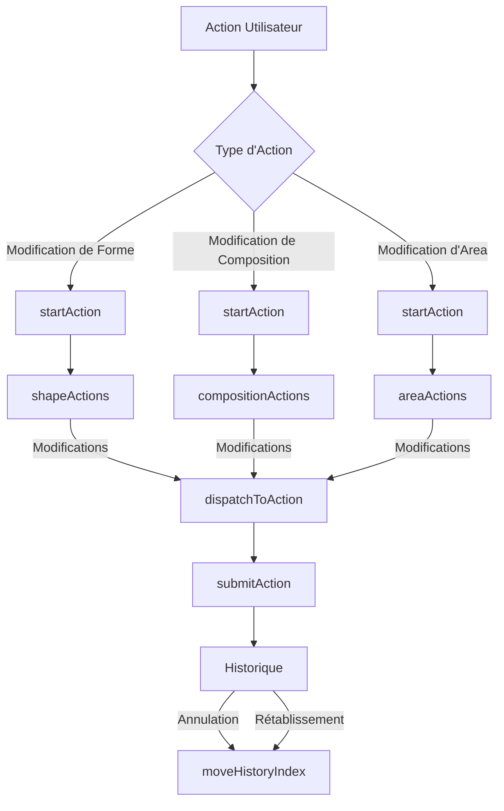
```mermaid
graph TD
    A[Action Utilisateur] --> B{Type d'Action}

    B -->|Modification de Forme| C[startAction]
    B -->|Modification de Composition| D[startAction]
    B -->|Modification d'Area| E[startAction]

    C --> F[shapeActions]
    D --> G[compositionActions]
    E --> H[areaActions]

    F -->|Modifications| I[dispatchToAction]
    G -->|Modifications| I
    H -->|Modifications| I

    I --> J[submitAction]
    J --> K[Historique]

    K -->|Annulation| L[moveHistoryIndex]
    K -->|Rétablissement| L
```

## Flux de Gestion des Formes

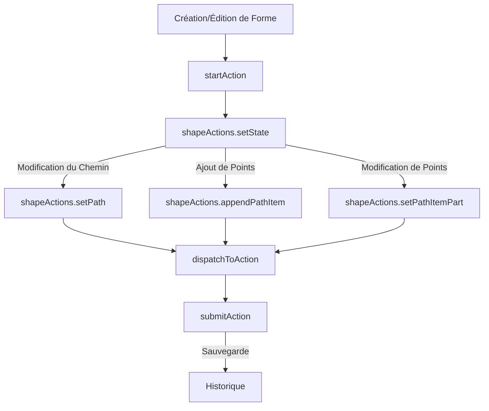
```mermaid
graph TD
    A[Création/Édition de Forme] --> B[startAction]
    B --> C[shapeActions.setState]

    C -->|Modification du Chemin| D[shapeActions.setPath]
    C -->|Ajout de Points| E[shapeActions.appendPathItem]
    C -->|Modification de Points| F[shapeActions.setPathItemPart]

    D --> G[dispatchToAction]
    E --> G
    F --> G

    G --> H[submitAction]
    H -->|Sauvegarde| I[Historique]
```

## Flux de Gestion des Compositions

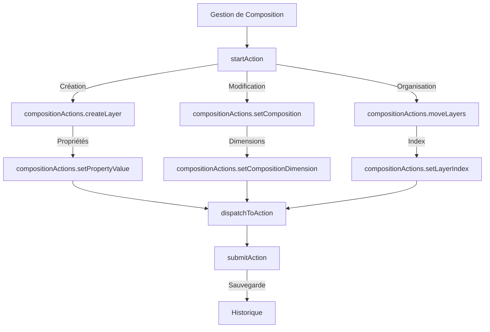
```mermaid
graph TD
    A[Gestion de Composition] --> B[startAction]

    B -->|Création| C[compositionActions.createLayer]
    B -->|Modification| D[compositionActions.setComposition]
    B -->|Organisation| E[compositionActions.moveLayers]

    C -->|Propriétés| F[compositionActions.setPropertyValue]
    D -->|Dimensions| G[compositionActions.setCompositionDimension]
    E -->|Index| H[compositionActions.setLayerIndex]

    F --> I[dispatchToAction]
    G --> I
    H --> I

    I --> J[submitAction]
    J -->|Sauvegarde| K[Historique]
```

## Flux de Gestion des Areas

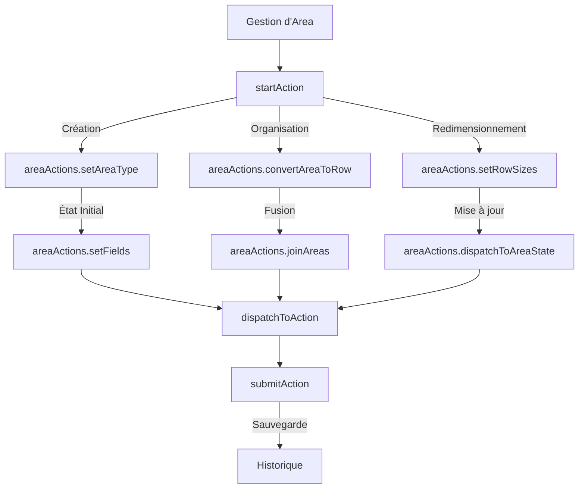
```mermaid
graph TD
    A[Gestion d'Area] --> B[startAction]

    B -->|Création| C[areaActions.setAreaType]
    B -->|Organisation| D[areaActions.convertAreaToRow]
    B -->|Redimensionnement| E[areaActions.setRowSizes]

    C -->|État Initial| F[areaActions.setFields]
    D -->|Fusion| G[areaActions.joinAreas]
    E -->|Mise à jour| H[areaActions.dispatchToAreaState]

    F --> I[dispatchToAction]
    G --> I
    H --> I

    I --> J[submitAction]
    J -->|Sauvegarde| K[Historique]
```

## Interactions entre Systèmes

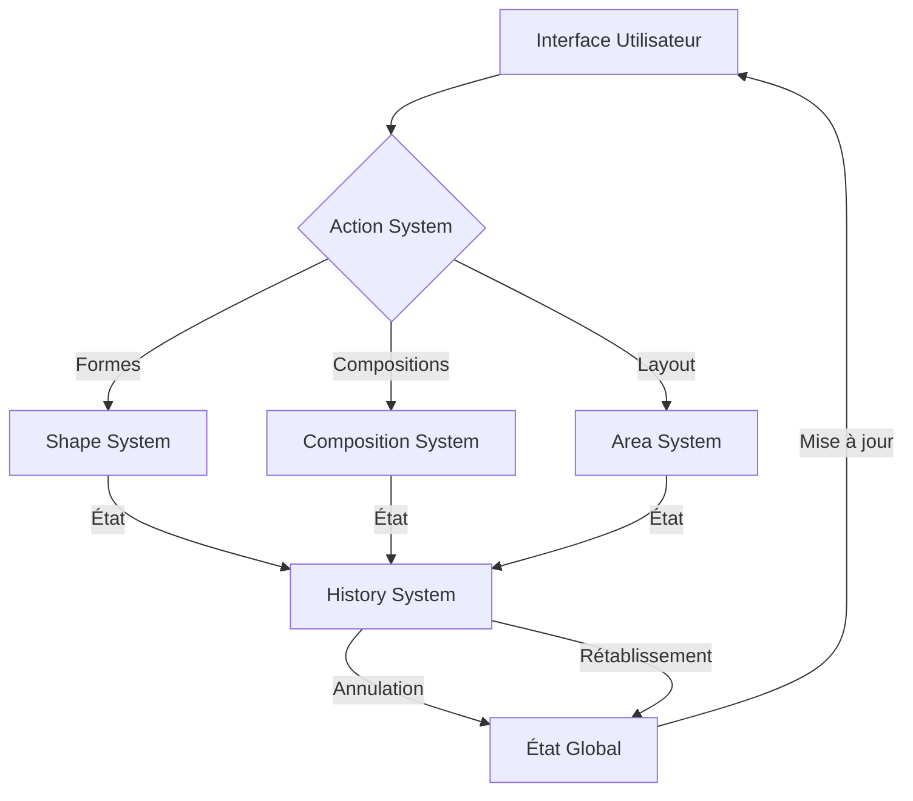
```mermaid
graph TD
    A[Interface Utilisateur] --> B{Action System}

    B -->|Formes| C[Shape System]
    B -->|Compositions| D[Composition System]
    B -->|Layout| E[Area System]

    C -->|État| F[History System]
    D -->|État| F
    E -->|État| F

    F -->|Annulation| G[État Global]
    F -->|Rétablissement| G

    G -->|Mise à jour| A
```

## Cycle de Vie d'une Action

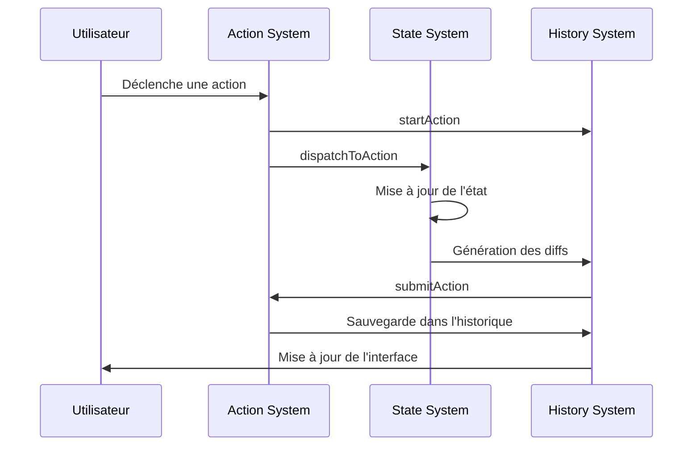
```mermaid
sequenceDiagram
    participant U as Utilisateur
    participant A as Action System
    participant S as State System
    participant H as History System

    U->>A: Déclenche une action
    A->>H: startAction
    A->>S: dispatchToAction
    S->>S: Mise à jour de l'état
    S->>H: Génération des diffs
    H->>A: submitAction
    A->>H: Sauvegarde dans l'historique
    H->>U: Mise à jour de l'interface
```

## Flux de Gestion des Propriétés Animées

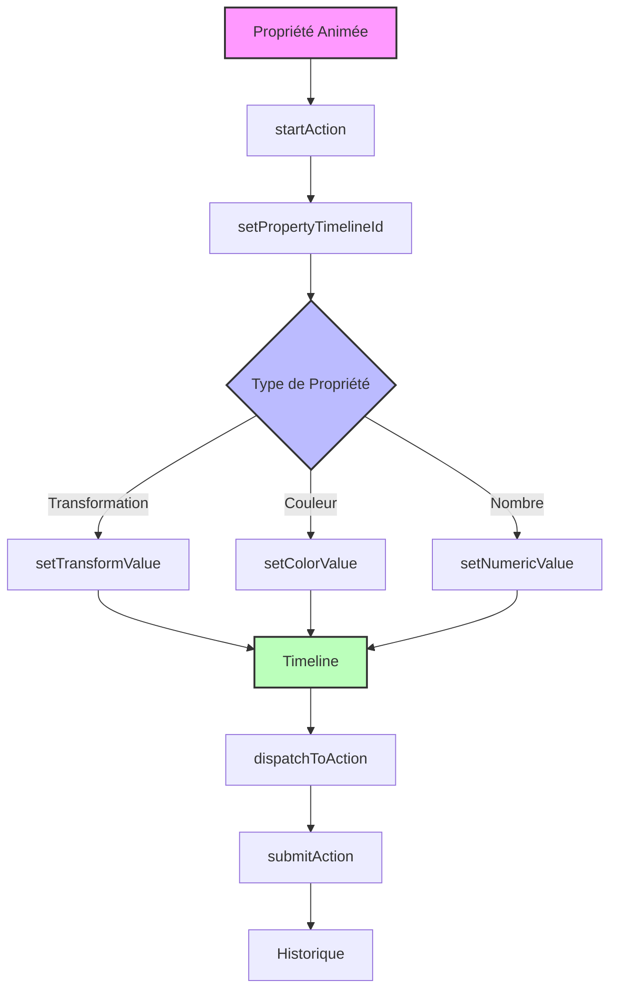
```mermaid
graph TD
    A[Propriété Animée] --> B[startAction]
    B --> C[setPropertyTimelineId]

    C --> D{Type de Propriété}
    D -->|Transformation| E[setTransformValue]
    D -->|Couleur| F[setColorValue]
    D -->|Nombre| G[setNumericValue]

    E --> H[Timeline]
    F --> H
    G --> H

    H --> I[dispatchToAction]
    I --> J[submitAction]
    J --> K[Historique]

    style A fill:#f9f,stroke:#333,stroke-width:2px
    style D fill:#bbf,stroke:#333,stroke-width:2px
    style H fill:#bfb,stroke:#333,stroke-width:2px
```

## Flux de Synchronisation des États

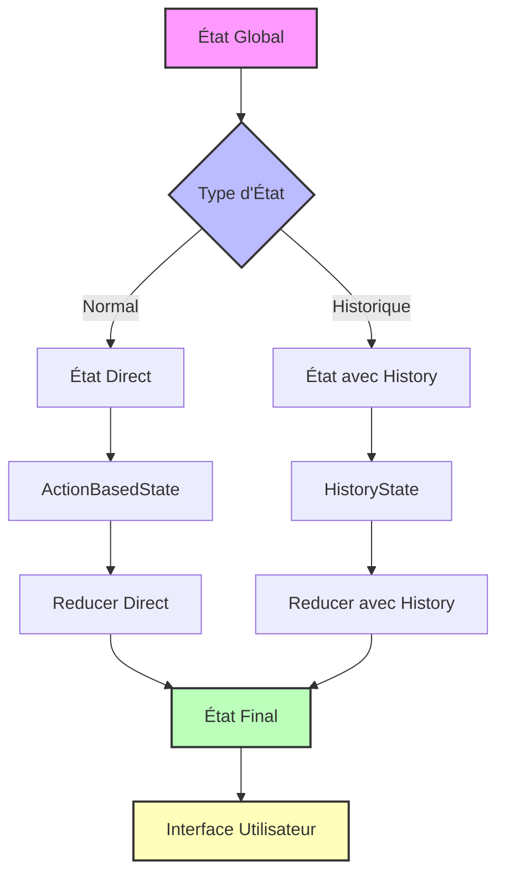
```mermaid
graph TD
    A[État Global] --> B{Type d'État}

    B -->|Normal| C[État Direct]
    B -->|Historique| D[État avec History]

    C --> E[ActionBasedState]
    D --> F[HistoryState]

    E --> G[Reducer Direct]
    F --> H[Reducer avec History]

    G --> I[État Final]
    H --> I

    I --> J[Interface Utilisateur]

    style A fill:#f9f,stroke:#333,stroke-width:2px
    style B fill:#bbf,stroke:#333,stroke-width:2px
    style I fill:#bfb,stroke:#333,stroke-width:2px
    style J fill:#ffb,stroke:#333,stroke-width:2px
```

## Flux de Résolution des Dépendances

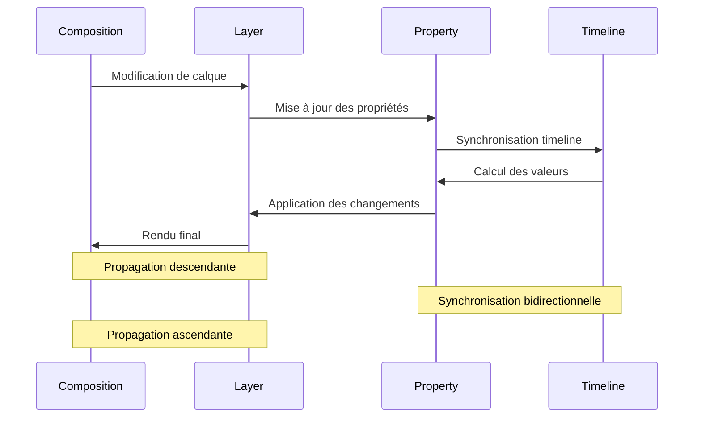
```mermaid
sequenceDiagram
    participant C as Composition
    participant L as Layer
    participant P as Property
    participant T as Timeline

    C->>L: Modification de calque
    L->>P: Mise à jour des propriétés
    P->>T: Synchronisation timeline
    T->>P: Calcul des valeurs
    P->>L: Application des changements
    L->>C: Rendu final

    note over C,L: Propagation descendante
    note over P,T: Synchronisation bidirectionnelle
    note over L,C: Propagation ascendante
```

## Flux de Gestion des Erreurs

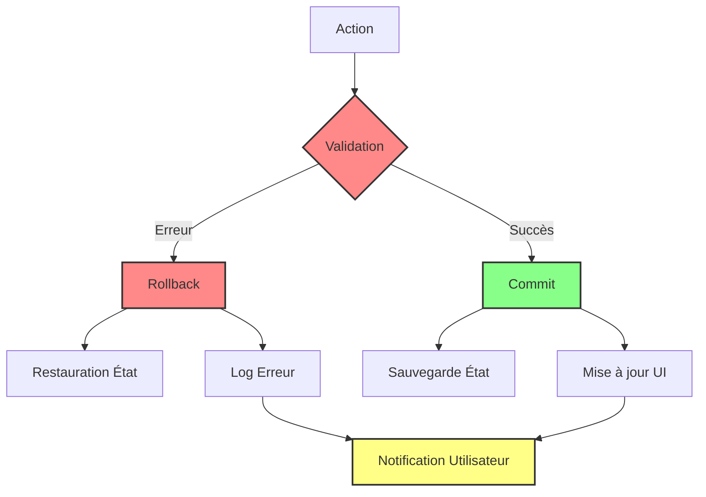
```mermaid
graph TD
    A[Action] --> B{Validation}

    B -->|Erreur| C[Rollback]
    B -->|Succès| D[Commit]

    C --> E[Restauration État]
    C --> F[Log Erreur]

    D --> G[Sauvegarde État]
    D --> H[Mise à jour UI]

    F --> I[Notification Utilisateur]
    H --> I

    style B fill:#f88,stroke:#333,stroke-width:2px
    style C fill:#f88,stroke:#333,stroke-width:2px
    style D fill:#8f8,stroke:#333,stroke-width:2px
    style I fill:#ff8,stroke:#333,stroke-width:2px
```

## Flux de Gestion des Middlewares

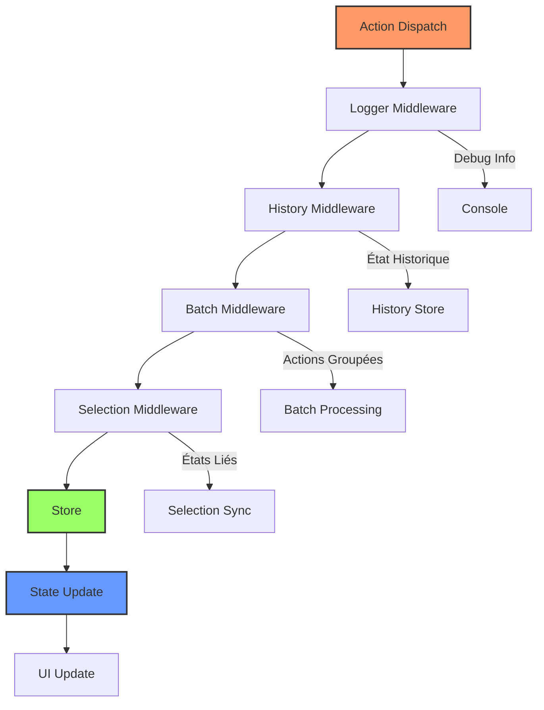
```mermaid
graph TD
    A[Action Dispatch] --> B[Logger Middleware]
    B --> C[History Middleware]
    C --> D[Batch Middleware]
    D --> E[Selection Middleware]
    E --> F[Store]

    B -->|Debug Info| G[Console]
    C -->|État Historique| H[History Store]
    D -->|Actions Groupées| I[Batch Processing]
    E -->|États Liés| J[Selection Sync]

    F --> K[State Update]
    K --> L[UI Update]

    style A fill:#f96,stroke:#333,stroke-width:2px
    style F fill:#9f6,stroke:#333,stroke-width:2px
    style K fill:#69f,stroke:#333,stroke-width:2px
```

## Flux de Migration vers Redux Toolkit

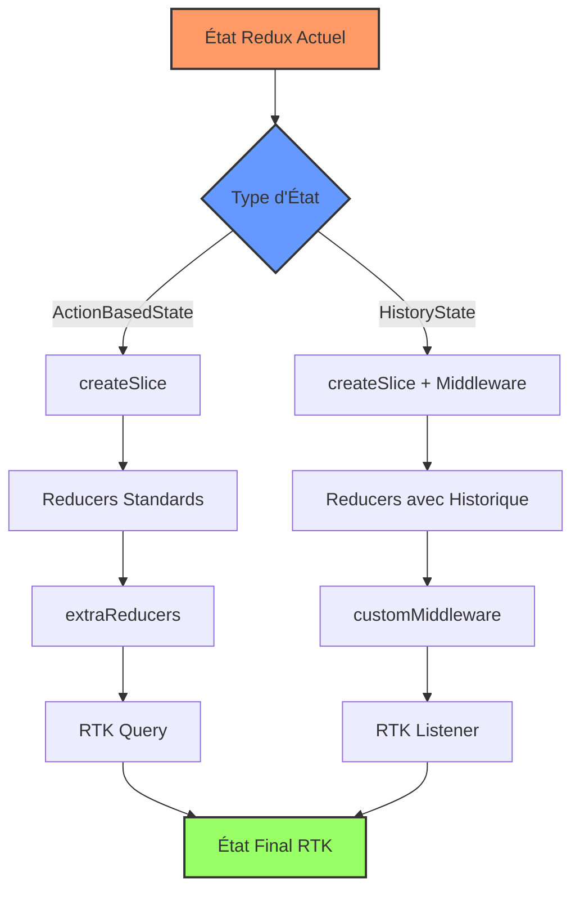
```mermaid
graph TD
    A[État Redux Actuel] --> B{Type d'État}

    B -->|ActionBasedState| C[createSlice]
    B -->|HistoryState| D[createSlice + Middleware]

    C --> E[Reducers Standards]
    D --> F[Reducers avec Historique]

    E --> G[extraReducers]
    F --> H[customMiddleware]

    G --> I[RTK Query]
    H --> J[RTK Listener]

    I --> K[État Final RTK]
    J --> K

    style A fill:#f96,stroke:#333,stroke-width:2px
    style K fill:#9f6,stroke:#333,stroke-width:2px
    style B fill:#69f,stroke:#333,stroke-width:2px
```

## Cas d'Usage Critiques

### 1. Opérations d'Annulation Multiple

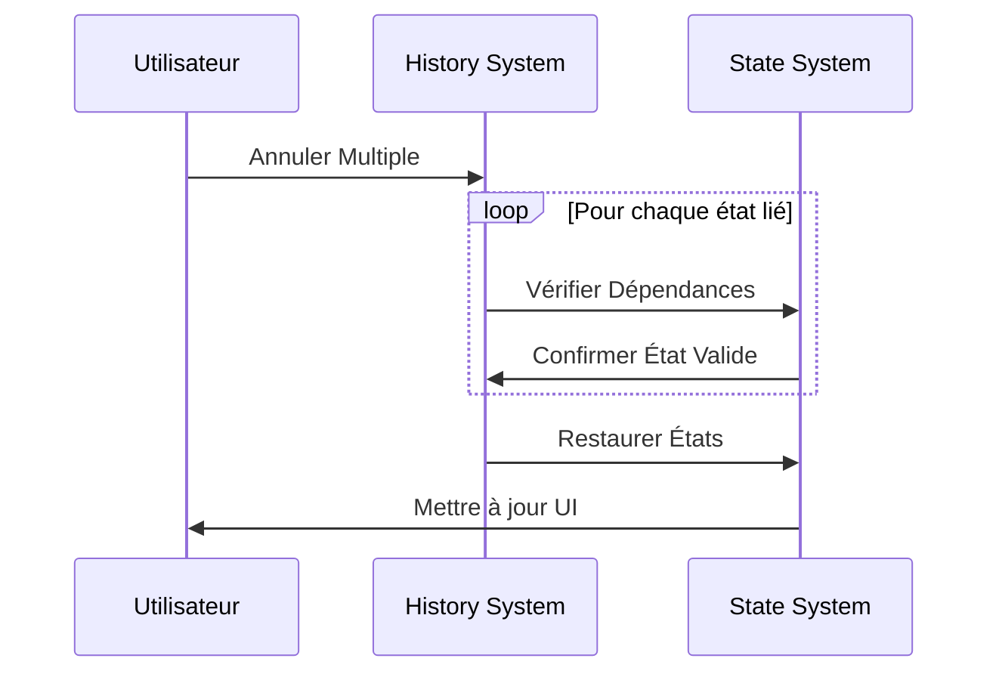
```mermaid
sequenceDiagram
    participant U as Utilisateur
    participant H as History System
    participant S as State System

    U->>H: Annuler Multiple
    loop Pour chaque état lié
        H->>S: Vérifier Dépendances
        S->>H: Confirmer État Valide
    end
    H->>S: Restaurer États
    S->>U: Mettre à jour UI
```

**Points Critiques :**

-   Maintien de la cohérence entre les états liés
-   Gestion des dépendances circulaires
-   Performance lors d'annulations multiples
-   Validation des états intermédiaires

### 2. Modifications en Batch

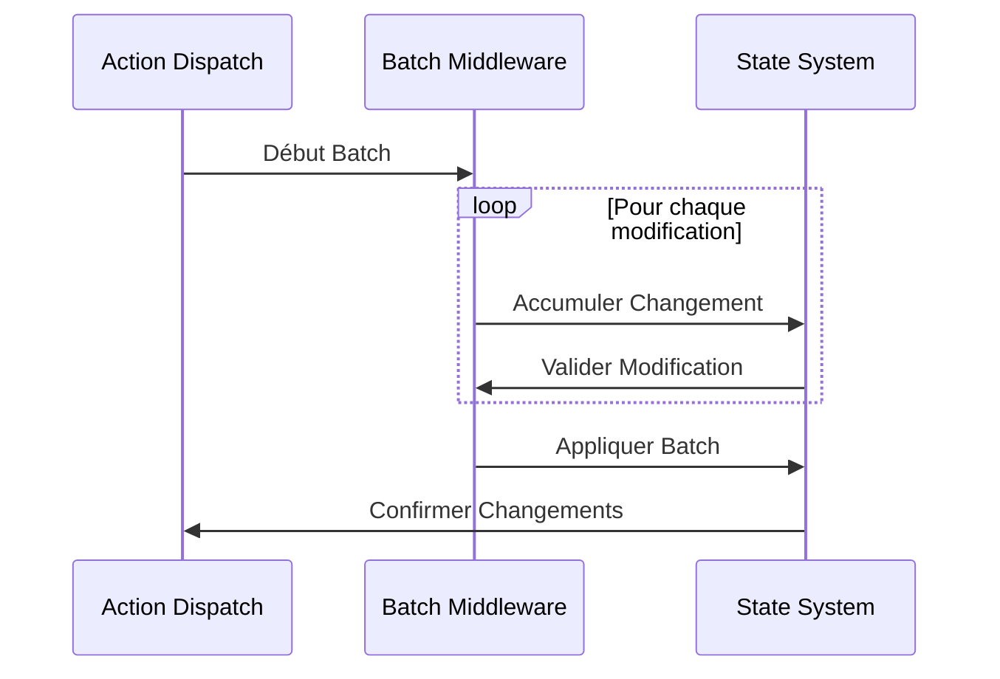
```mermaid
sequenceDiagram
    participant A as Action Dispatch
    participant B as Batch Middleware
    participant S as State System

    A->>B: Début Batch
    loop Pour chaque modification
        B->>S: Accumuler Changement
        S->>B: Valider Modification
    end
    B->>S: Appliquer Batch
    S->>A: Confirmer Changements
```

**Points Critiques :**

-   Atomicité des opérations batch
-   Gestion de la mémoire
-   Performance des validations
-   Rollback en cas d'erreur

### 3. Synchronisation des Sélections

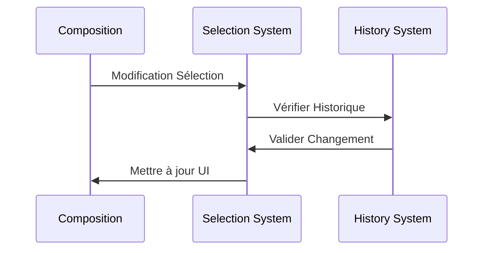
```mermaid
sequenceDiagram
    participant C as Composition
    participant S as Selection System
    participant H as History System

    C->>S: Modification Sélection
    S->>H: Vérifier Historique
    H->>S: Valider Changement
    S->>C: Mettre à jour UI
```

**Points Critiques :**

-   Cohérence des sélections multiples
-   Performance des mises à jour UI
-   Gestion des conflits de sélection
-   Historique des sélections

### 4. Gestion des Propriétés Animées Complexes

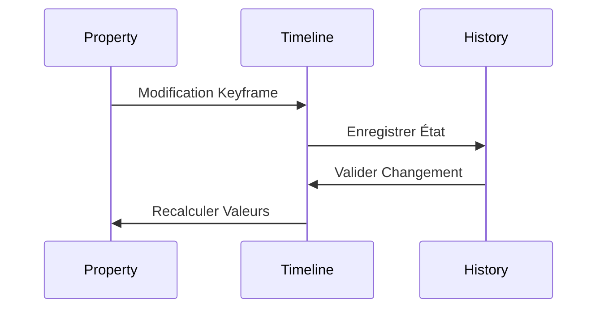
```mermaid
sequenceDiagram
    participant P as Property
    participant T as Timeline
    participant H as History

    P->>T: Modification Keyframe
    T->>H: Enregistrer État
    H->>T: Valider Changement
    T->>P: Recalculer Valeurs
```

**Points Critiques :**

-   Performance des calculs d'interpolation
-   Gestion de la mémoire pour les timelines longues
-   Précision des calculs de valeurs
-   Synchronisation avec le rendu

### 5. Opérations de Rendu

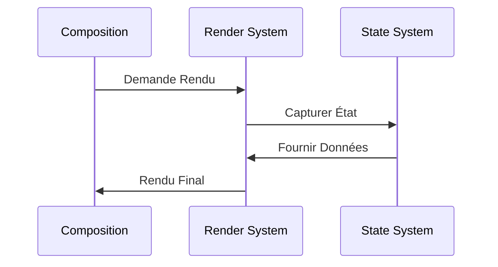
```mermaid
sequenceDiagram
    participant C as Composition
    participant R as Render System
    participant S as State System

    C->>R: Demande Rendu
    R->>S: Capturer État
    S->>R: Fournir Données
    R->>C: Rendu Final
```

**Points Critiques :**

-   Performance du rendu
-   Gestion de la mémoire
-   Cohérence des états pendant le rendu
-   Optimisation des calculs

### 6. Migrations de Données

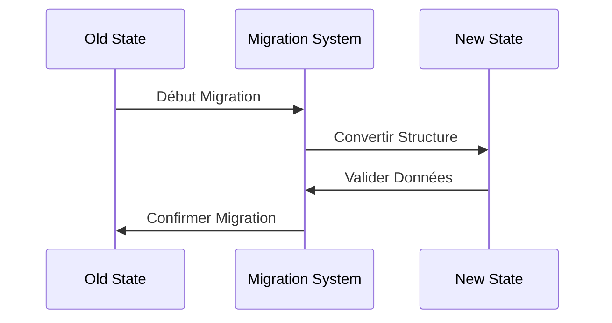
```mermaid
sequenceDiagram
    participant O as Old State
    participant M as Migration System
    participant N as New State

    O->>M: Début Migration
    M->>N: Convertir Structure
    N->>M: Valider Données
    M->>O: Confirmer Migration
```

**Points Critiques :**

-   Compatibilité ascendante/descendante
-   Validation des données migrées
-   Performance des migrations massives
-   Gestion des erreurs de migration

## Tests de Non-Régression

### 1. Tests d'Intégrité des États

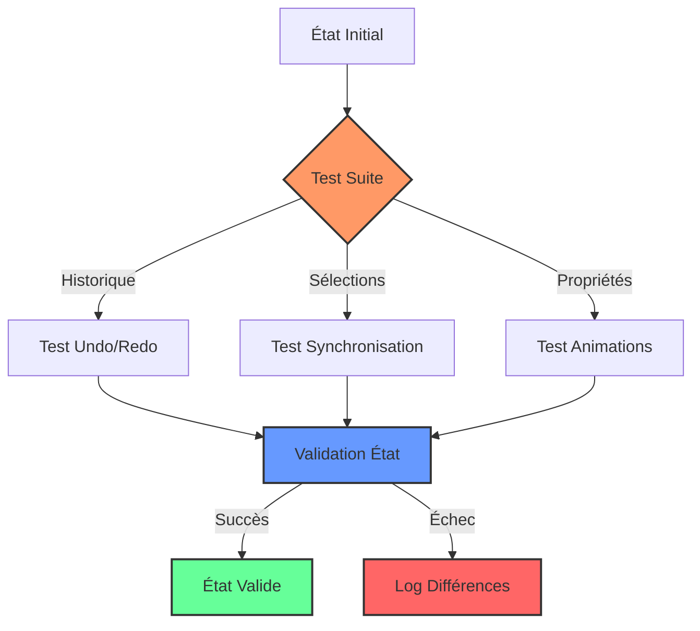
```mermaid
graph TD
    A[État Initial] --> B{Test Suite}
    B -->|Historique| C[Test Undo/Redo]
    B -->|Sélections| D[Test Synchronisation]
    B -->|Propriétés| E[Test Animations]

    C --> F[Validation État]
    D --> F
    E --> F

    F -->|Succès| G[État Valide]
    F -->|Échec| H[Log Différences]

    style B fill:#f96,stroke:#333,stroke-width:2px
    style F fill:#69f,stroke:#333,stroke-width:2px
    style G fill:#6f9,stroke:#333,stroke-width:2px
    style H fill:#f66,stroke:#333,stroke-width:2px
```

**Scénarios de Test :**

-   Comparaison des snapshots d'état avant/après migration
-   Validation des structures de données
-   Vérification des références entre états
-   Tests de sérialisation/désérialisation

### 2. Tests de Performance

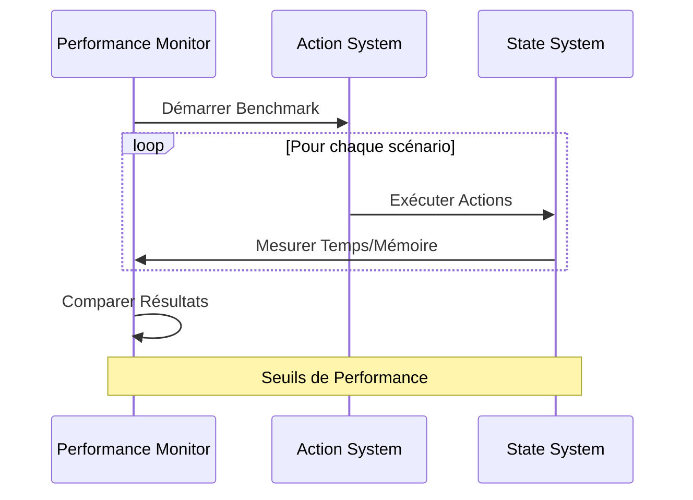
```mermaid
sequenceDiagram
    participant P as Performance Monitor
    participant A as Action System
    participant S as State System

    P->>A: Démarrer Benchmark
    loop Pour chaque scénario
        A->>S: Exécuter Actions
        S->>P: Mesurer Temps/Mémoire
    end
    P->>P: Comparer Résultats

    note over P,S: Seuils de Performance
```

**Métriques Clés :**

-   Temps de réponse des actions
-   Consommation mémoire
-   Taille des états sérialisés
-   Temps de rendu UI

### 3. Tests de Flux d'Actions

```mermaid
graph TD
    A[Action Test] --> B{Type de Test}

    B -->|Unitaire| C[Test Reducer]
    B -->|Intégration| D[Test Middleware]
    B -->|E2E| E[Test UI]

    C --> F[Assertions État]
    D --> F
    E --> F

    F -->|Valide| G[Test Réussi]
    F -->|Invalide| H[Diagnostic]

    style B fill:#bbf,stroke:#333,stroke-width:2px
    style F fill:#fb9,stroke:#333,stroke-width:2px
```

**Scénarios Critiques :**

-   Chaînes d'actions complexes
-   Actions concurrentes
-   Actions batch
-   Annulation/rétablissement multiple

### 4. Tests de Migration de Données

```mermaid
sequenceDiagram
    participant O as Old Store
    participant M as Migration
    participant N as New Store
    participant V as Validator

    O->>M: Export Données
    M->>N: Migration
    N->>V: Validation
    V->>V: Comparaison
    V-->>O: Rapport
```

**Points de Vérification :**

-   Structure des données
-   Valeurs des propriétés
-   Relations entre objets
-   Historique des actions

### 5. Tests de Charge

```mermaid
graph TD
    A[Test de Charge] --> B[Génération Data]
    B --> C{Scénarios}

    C -->|Compositions| D[Test Volume]
    C -->|Actions| E[Test Concurrence]
    C -->|Historique| F[Test Mémoire]

    D --> G[Analyse]
    E --> G
    F --> G

    style C fill:#f96,stroke:#333,stroke-width:2px
    style G fill:#6f9,stroke:#333,stroke-width:2px
```

**Paramètres de Test :**

-   Nombre d'objets
-   Profondeur d'historique
-   Complexité des animations
-   Taille des batches

### 6. Tests de Compatibilité

```mermaid
sequenceDiagram
    participant L as Legacy Code
    participant R as RTK Code
    participant T as Test Runner

    L->>T: Exécuter Scénario
    R->>T: Exécuter Même Scénario
    T->>T: Comparer Résultats
    T-->>L: Rapport Différences
    T-->>R: Rapport Différences
```

**Aspects Testés :**

-   API publique
-   Format des données
-   Comportement des middlewares
-   Gestion des erreurs

### 7. Matrice de Tests

| Catégorie   | Scénarios             | Assertions           | Outils                      |
| ----------- | --------------------- | -------------------- | --------------------------- |
| État        | Mutations, Sélections | Égalité structurelle | Jest, deep-equal            |
| Actions     | Séquences, Batches    | Ordre, Timing        | Redux Mock Store            |
| Performance | Charge, Mémoire       | Seuils, Métriques    | Lighthouse, Chrome DevTools |
| Migration   | Import/Export         | Compatibilité        | Custom Validators           |
| UI          | Rendu, Events         | Screenshots, DOM     | Testing Library, Cypress    |

### 8. Pipeline d'Exécution

```mermaid
graph TD
    A[Start] --> B[Tests Unitaires]
    B --> C[Tests Integration]
    C --> D[Tests Migration]
    D --> E[Tests Performance]
    E --> F[Tests E2E]

    style A fill:#f96,stroke:#333,stroke-width:2px
    style F fill:#6f9,stroke:#333,stroke-width:2px
```

**Étapes Automatisées :**

-   Génération des données de test
-   Exécution des scénarios
-   Collecte des métriques
-   Génération des rapports
-   Validation des seuils

## Dépendances entre États

### 1. Graphe des Dépendances

```mermaid
graph TD
    A[Composition State] --> B[Layer State]
    A --> C[Timeline State]
    B --> D[Property State]
    B --> E[Shape State]
    C --> D
    D --> F[Selection State]
    E --> F

    style A fill:#f96,stroke:#333,stroke-width:2px
    style D fill:#69f,stroke:#333,stroke-width:2px
    style F fill:#6f9,stroke:#333,stroke-width:2px
```

### 2. Relations Critiques

| État Source | État Dépendant | Type de Dépendance | Impact                  |
| ----------- | -------------- | ------------------ | ----------------------- |
| Composition | Layer          | Parent-Child       | Cascade de mises à jour |
| Layer       | Property       | Ownership          | Synchronisation requise |
| Timeline    | Property       | Temporal           | Recalcul des valeurs    |
| Shape       | Selection      | Reference          | Maintien cohérence      |
| Property    | Timeline       | Bidirectional      | Mise à jour mutuelle    |

### 3. Cycles de Mise à Jour

```mermaid
sequenceDiagram
    participant C as Composition
    participant L as Layer
    participant P as Property
    participant T as Timeline
    participant S as Selection

    C->>L: Update Layer
    L->>P: Sync Properties
    P->>T: Update Timeline
    T->>P: Recompute Values
    P->>S: Update Selection
    S-->>C: Notify Changes

    note over C,S: Cycle Complet de Mise à Jour
```

### 4. Points de Synchronisation

#### 4.1 Composition → Layer

-   Propagation des transformations
-   Gestion de la hiérarchie
-   Mise à jour des masques

```mermaid
graph LR
    A[Composition Transform] --> B[Layer Transform]
    B --> C[Child Layers]
    B --> D[Mask Updates]
```

#### 4.2 Layer → Property

-   État des propriétés animées
-   Valeurs calculées
-   Dépendances temporelles

```mermaid
graph LR
    A[Layer State] --> B[Property Values]
    B --> C[Computed Values]
    B --> D[Timeline Sync]
```

#### 4.3 Timeline → Property

-   Interpolation des valeurs
-   Keyframes
-   État de lecture

```mermaid
graph LR
    A[Timeline Position] --> B[Property Interpolation]
    B --> C[Current Value]
    A --> D[Keyframe State]
```

### 5. Contraintes de Migration

#### 5.1 Ordre de Migration

```mermaid
graph TD
    A[États Indépendants] --> B[États avec Dépendances Simples]
    B --> C[États avec Dépendances Complexes]
    C --> D[États avec Dépendances Circulaires]

    style A fill:#9f9,stroke:#333,stroke-width:2px
    style D fill:#f99,stroke:#333,stroke-width:2px
```

#### 5.2 Points d'Attention

-   **Atomicité des Mises à Jour**

    -   Garantir la cohérence des états liés
    -   Gérer les transactions multi-états
    -   Maintenir l'historique des dépendances

-   **Performance**

    -   Optimiser les chaînes de mise à jour
    -   Minimiser les recalculs en cascade
    -   Mettre en cache les valeurs dérivées

-   **Gestion des Erreurs**
    -   Rollback coordonné
    -   Restauration cohérente
    -   Validation des états liés

### 6. Stratégies de Synchronisation

```mermaid
graph TD
    A[Détection Changement] --> B{Type Sync}
    B -->|Immédiat| C[Sync Direct]
    B -->|Différé| D[Queue Updates]
    B -->|Batch| E[Batch Updates]

    C --> F[Validation]
    D --> F
    E --> F

    F -->|Success| G[Apply]
    F -->|Failure| H[Rollback]

    style B fill:#bbf,stroke:#333,stroke-width:2px
    style F fill:#fb9,stroke:#333,stroke-width:2px
```

### 7. Matrice de Dépendances

| État        | Dépendances Directes | Dépendances Inverses  | Contraintes                      |
| ----------- | -------------------- | --------------------- | -------------------------------- |
| Composition | Timeline, Layer      | Selection             | Ordre hiérarchique               |
| Layer       | Property, Shape      | Composition           | Propagation cascade              |
| Property    | Timeline             | Layer, Selection      | Synchronisation bidirectionnelle |
| Timeline    | -                    | Property, Composition | Cohérence temporelle             |
| Shape       | -                    | Layer, Selection      | Intégrité géométrique            |
| Selection   | Shape, Layer         | -                     | Unicité référence                |

## Bonnes Pratiques

1. **Séquence d'Actions**

    - Toujours commencer par `startAction`
    - Grouper les modifications liées
    - Terminer par `submitAction`

2. **Gestion de l'État**

    - Maintenir la cohérence entre les systèmes
    - Valider les états intermédiaires
    - Gérer les dépendances entre actions

3. **Performance**
    - Minimiser les dispatches inutiles
    - Optimiser les mises à jour d'état
    - Gérer efficacement l'historique

## Voir aussi

-   [Actions de Forme](./shape-actions.md)
-   [Actions de Composition](./composition-actions.md)
-   [Actions d'Area](./area-actions.md)
-   [Actions d'Historique](./history-actions.md)
-   [Types d'Actions](./types.md)
-   [Architecture Technique](../technical/architecture.md)
-   [Gestion d'État](../technical/state.md)
-   [Patterns d'Historique](../technical/history-patterns.md)
